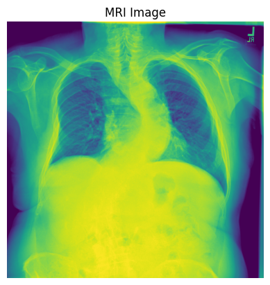

# Automated Medical Report Generation from X-ray Images

## Project Overview

This project focuses on automating the generation of medical reports from X-ray images using deep learning. Manual interpretation of X-ray images by medical professionals is a time-consuming process, which can lead to delays in patient care. To address this, we propose a multi-modal deep learning model that leverages the power of Vision Transformers (ViT) for image feature extraction and GPT-2 for natural language generation.

## Model Architecture

The core of our solution is a Transformer-based architecture designed for effective cross-modal understanding:

1.  **Image Encoder (Vision Transformer - ViT)**: A pre-trained Vision Transformer model is used to extract high-level features from input X-ray images. ViT is chosen for its excellent performance in image recognition tasks, allowing it to capture intricate visual patterns relevant to medical diagnoses.

2.  **Text Decoder (GPT-2 Language Model)**: A GPT-2 language model is employed to generate descriptive medical reports. GPT-2, with its strong language generation capabilities, can produce coherent and medically relevant text based on the features provided by the image encoder.

3.  **Cross-Attention Mechanism**: A crucial component that connects the image encoder and text decoder. This mechanism ensures that the decoder aligns the generated text with the extracted image features.

## Implementation Details

The project is implemented using Python, primarily leveraging the PyTorch deep learning framework and Hugging Face's Transformers library for pre-trained models.

* **Libraries Used**:
    * `PyTorch`: For building and training the neural network models.
    * `Hugging Face Transformers`: For easily incorporating pre-trained ViT and GPT-2 models.
    * `Pandas`: For efficient data handling and manipulation of CSV files containing image metadata and reports.
    * `Matplotlib`: For visualizing images and potentially plotting training metrics.
    * `NLTK`: For natural language processing tasks, particularly for calculating BLEU scores.

* **Data Loading**:
    * X-ray images and their corresponding medical reports are loaded from CSV files.
    * The `indiana_projections.csv` and `indiana_reports.csv` datasets from Kaggle's "Chest X-Ray Images from Indiana University" are utilized.
    * Images undergo essential preprocessing steps, including resizing and normalization, to ensure compatibility with the ViT model's input requirements.

* **Training Process**:
    * The model is trained end-to-end on a dataset consisting of paired X-ray images and their associated medical reports.
    * The training objective is to minimize the difference between the generated reports and the ground-truth reports.
    * The `AdamW` optimizer is used for its effectiveness in training Transformer-based models.
    * The dataset is split into training and validation sets (80% training, 20% testing) to monitor performance and prevent overfitting.

## Example Output

Here's an example of an X-ray image and the generated medical report:

**MRI Image**

* **Image Path**: `/content/chest-xrays-indiana-university/images/images_normalized/484_IM-2108-1001.dcm.png`
* **Original Report**: `The heart is normal in size. The mediastinum is stable. There is again significant thoracolumbar rotatory scoliosis. The aorta is atherosclerotic. The lungs are hypoinflated but clear.`
* **Generated Report**: `heart size is normal. The mediastinal contour is within normal limits. The lungs are free of any focal infiltrates. There are no nodules or masses. No visible pneumothorax. No visible pleural fluid. The XXXX are grossly normal. There is no visible free intraperitoneal air under the diaphragm.`

## Evaluation Metrics

To assess the quality of the generated reports, text similarity metrics were used:

* **BLEU Score**: Measures the similarity between generated and actual reports.
* **ROUGE-L Score**: Evaluates how well key phrases match between generated and real reports.

Higher scores indicate that the generated reports closely match the expert-written reports.